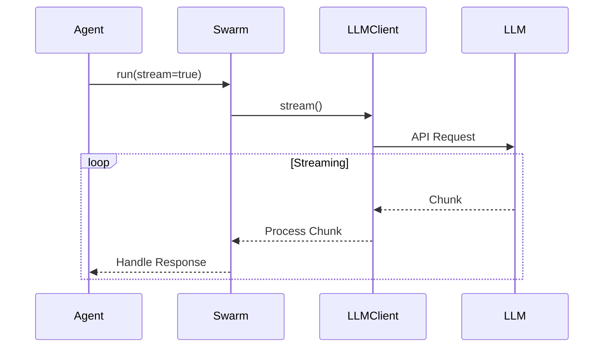

# Swarm Java Implementation Design Document

## Core Components

1. **Agent System**
   - Core interface: `Agent`
   - Key responsibilities:
     - Execute requests with context
     - Provide system prompt
     - Define tool choice mode
     - Implement functions with annotations

2. **Function Annotation System**
   - `@FunctionSpec`: Defines function metadata
     - name: Function name for LLM
     - description: Function description
   - `@Parameter`: Defines parameter metadata
     - name: Parameter name
     - description: Parameter description
     - type: Parameter type (default: "string")
     - required: Whether parameter is required (default: true)

3. **Result System**
   - Core class: `Result`
   - Encapsulates function return values:
     - value: The actual return value
     - contextUpdates: Updates to context variables
   - Supports:
     - Simple string returns
     - Complex object returns
     - Context variable updates

4. **LLM Client System**
   - Base interface: `LLMClient`
   - Implementations:
     - OpenAIClient
     - AzureOpenAIClient
     - ChatGLMClient
     - OllamaClient
   - Configuration:
     - API keys
     - Base URLs
     - Model selection
     - Provider-specific settings

5. **Context Management**
   - Maintains shared context between turns
   - Supports variable persistence
   - Thread-safe operations

## Core Workflows

1. **Agent Execution Flow**
```
Initialize Agent
    ↓
Load System Prompt
    ↓
Discover Functions (via annotations)
    - Scan for @FunctionSpec
    - Extract parameter info
    - Build function descriptions
    ↓
Process Messages
    ↓
Handle Tool Calls
    - Validate function exists
    - Convert parameters
    - Execute function
    - Process result
    ↓
Generate Response
```

2. **Function Discovery Flow**
```
Scan Agent Class
    ↓
Find @FunctionSpec Methods
    ↓
For Each Method:
    - Get function name & description
    - Get parameter annotations
    - Build parameter schema
    - Create function mapping
    ↓
Build Function Descriptions
```

3. **Function Execution Flow**
```
Receive Tool Call
    ↓
Find Annotated Method
    ↓
Convert Parameters
    - JSON to Java types
    - Validate required params
    - Apply type conversion
    ↓
Invoke Method
    ↓
Process Result
    - Convert to JSON
    - Update context
```

4. **Result Processing Flow**
```
Function Execution
    ↓
Create Result
    - Wrap return value
    - Add context updates
    ↓
Process Result
    - Update context
    - Format for LLM
    - Handle special cases
    ↓
Return to Agent
```

## Example Implementation

1. **Weather Agent Example**
```java
public class WeatherAgent implements Agent {
    @FunctionSpec(
        name = "get_weather",
        description = "Get weather for location"
    )
    @Parameters({
        @Parameter(name = "location", description = "City and state")
    })
    public Result getWeather(String location) {
        WeatherResponse weather = // get weather...
        return new Result(weather)
            .withContextUpdate("last_location", location)
            .withContextUpdate("last_weather", weather);
    }
}
```

2. **Result Class Example**
```java
public class Result {
    private final Object value;
    private final Map<String, Object> contextUpdates;
    
    public Result(Object value) {
        this.value = value;
        this.contextUpdates = new HashMap<>();
    }
    
    public Result withContextUpdate(String key, Object value) {
        contextUpdates.put(key, value);
        return this;
    }
}
```

## Key Features

1. **Annotation-Based Discovery**
   - No manual function registration
   - Automatic schema generation
   - Type-safe parameter handling

2. **Flexible LLM Support**
   - Multiple provider support
   - Environment-based configuration
   - Model configuration in client

3. **Simple Agent Development**
   - Implement Agent interface
   - Add function annotations
   - Define system prompt

4. **Error Handling**
   - LLM API errors
   - Function execution errors
   - Parameter validation errors

## Streaming Support

The framework provides real-time streaming capabilities:



1. **Implementation Details**
   - Uses reactive streams for backpressure
   - Supports provider-specific formats:
     - OpenAI: Server-Sent Events
     - ChatGLM: Custom streaming
     - Ollama: Line-delimited JSON

2. **Error Handling**
   - Connection failures
   - Malformed responses
   - Rate limiting
   - Token limits

## Error Handling Strategy

1. **Levels of Error Handling**
   - API-level errors (rate limits, authentication)
   - Parsing errors (malformed JSON)
   - Business logic errors (invalid parameters)
   - Network errors (timeouts, disconnects)

2. **Retry Mechanism**
   ```mermaid
   graph TD
       A[Error Occurs] --> B{Retryable?}
       B -->|Yes| C[Exponential Backoff]
       C --> D[Retry Request]
       D --> E{Success?}
       E -->|No| B
       E -->|Yes| F[Continue]
       B -->|No| G[Throw Exception]
   ```

3. **Error Categories**
   - Transient: Network issues, rate limits
   - Permanent: Invalid API keys, unsupported models
   - Business: Invalid input, context limits

## Context Management

1. **Thread Safety**
   - Read-write locks for context access
   - Atomic operations for updates
   - Copy-on-write for collections

2. **Context Lifecycle**
   ```mermaid
   stateDiagram-v2
       [*] --> Initialize
       Initialize --> Active
       Active --> Updated: Function Call
       Updated --> Active
       Active --> Saved: Save State
       Saved --> Active: Restore
       Active --> [*]: End
   ```

3. **Context Variables**
   - System variables (read-only)
   - User variables (read-write)
   - Function results (append-only)
   - Temporary state (scoped)

4. **Memory Management**
   - Context size limits
   - Cleanup strategies
   - Persistence options

## Configuration System

1. **Environment Variables**
   - Provider selection
   - API keys
   - Base URLs
   - Model selection

2. **Example Environment Setup**
```properties
# LLM Configuration
OPENAI_API_KEY=sk-xxx
OPENAI_MODEL=gpt-4

# Azure Configuration
AZURE_OPENAI_KEY=xxx
AZURE_OPENAI_MODEL=gpt-35-turbo

# Other Providers...
```

## Best Practices

1. **Agent Design**
   - Single responsibility
   - Clear system prompts
   - Well-documented functions
   - Proper error handling

2. **Function Implementation**
   - Clear parameter descriptions
   - Proper type annotations
   - Validation of inputs
   - Meaningful return values

3. **Error Handling**
   - Graceful degradation
   - Clear error messages
   - Context preservation
   - Retry strategies

4. **Configuration**
   - Use environment variables
   - Provide clear templates
   - Document requirements
   - Validate settings

## Future Enhancements

1. **Additional Features**
   - Streaming support
   - Function result caching
   - Batch processing
   - Rate limiting

2. **Provider Support**
   - Additional LLM providers
   - Provider-specific features
   - Custom implementations

3. **Tool Support**
   - Additional parameter types
   - Complex return types
   - Nested objects
   - Arrays and collections

4. **Development Tools**
   - Function testing utilities
   - Schema validators
   - Documentation generators
   - Debug helpers
